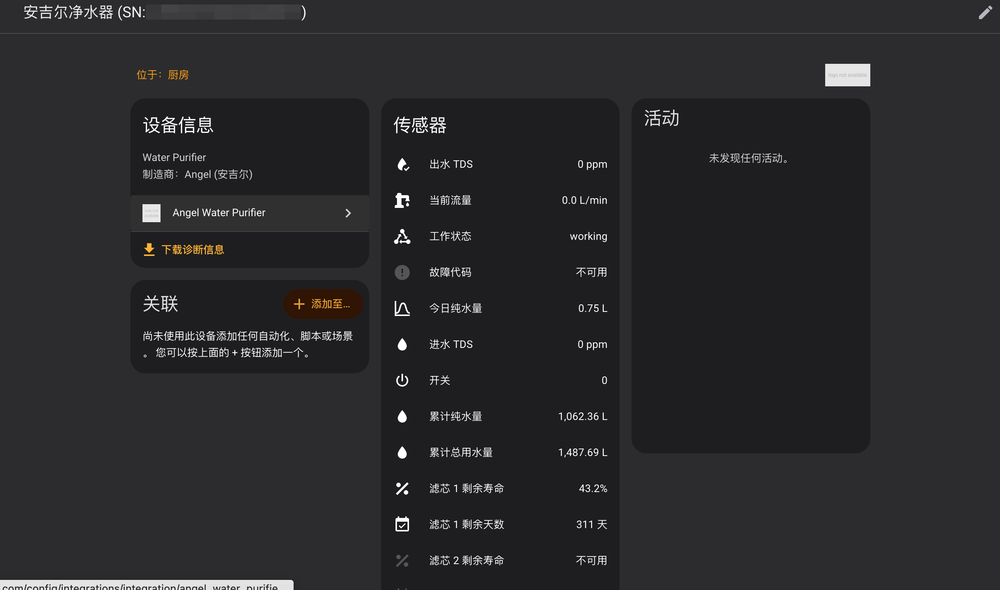
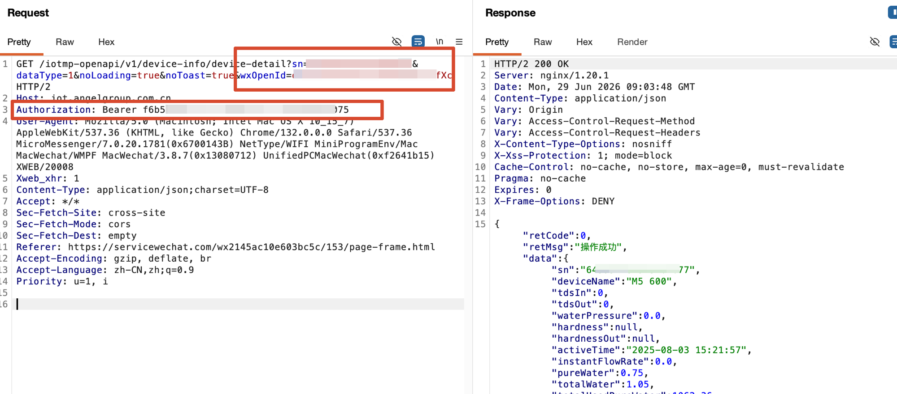

# 安吉尔净水器 — Home Assistant 自定义组件

> 通过安吉尔 IoT 云平台 API 在 Home Assistant 中监测你的安吉尔（Angel）净水器。



---

## 工作原理

通过 HTTPS 调用 **安吉尔 IoT 云平台** (`iot.angelgroup.com.cn`) 获取净水器实时数据。

基于对安吉尔微信小程序的抓包逆向，已验证的 API 端点：

```http
GET /iotmp-openapi/v1/device-info/device-detail?sn={SN}&dataType=1
```

**认证流程（OAuth2）**：小程序启动时用 `wx_code`（微信临时登录码）换取 token 对（access_token 约 24 小时、refresh_token 约 30 天）。集成使用 `refresh_token` 通过标准 OAuth2 刷新接口自动续期，不依赖微信环境。

**Token 自动续期**：配置 `refresh_token` 后，access_token 会在过期前（剩余 < 10 分钟）自动刷新，refresh_token 每次刷新自动旋转（30 天滑动续期），401 时也会强制刷新重试，无需再手动更新凭证。

设备型号: **J3402-ROB90（防伪款）** / **M5 600**

## 传感器实体（34 个固定 + 最多 44 个滤芯）

### 固定传感器

| 实体 ID | 描述 | 单位 | API 字段 |
|---------|------|------|----------|
| `sensor.tds_in` | 进水 TDS | ppm | `tdsIn` |
| `sensor.tds_out` | 出水 TDS | ppm | `tdsOut` |
| `sensor.tds_rejection_rate` | 脱盐率 | % | 由 TDS 计算 |
| `sensor.flow_rate` | 当前流量 | L/min | `instantFlowRate` |
| `sensor.water_pressure` | 水压 | MPa | `waterPressure` |
| `sensor.total_water_usage` | 累计纯水量 | L | `totalUsedPureWater` |
| `sensor.total_water_in` | 累计总用水量 | L | `totalUsedWater` |
| `sensor.today_pure_water` | 今日纯水量 | L | `pureWater` |
| `sensor.today_total_water` | 今日总用水量 | L | `totalWater` |
| `sensor.total_target_water` | 目标水量 | L | `totalTargetWater` |
| `sensor.mineral_water_total` | 矿物质水总量 | L | `mineralWaterTotal` |
| `sensor.working_status` | 工作状态 | — | `deviceState` |
| `sensor.wash_state` | 冲洗状态 | — | `washState` |
| `sensor.is_open` | 开关 | — | `isOpen` |
| `sensor.online_state` | 在线状态 | — | `onlineState` |
| `sensor.hot_water_outlet` | 热水出水 | — | `hotWaterOutletState` |
| `sensor.regeneration_step` | 再生步骤 | — | `regenerationStep` |
| `sensor.bind_type` | 绑定类型 | — | `bindType` |
| `sensor.error_code` | 故障代码 | — | `warnCode` |
| `sensor.error_message` | 故障信息 | — | `warnMsg` |
| `sensor.refresh_time` | 数据刷新时间 | — | `refreshTime` |
| `sensor.active_time` | 最后活跃时间 | — | `activeTime` |
| `sensor.reminder_push` | 提醒推送 | — | `reminderPush` |
| `sensor.water_intake_push` | 饮水提醒推送 | — | `waterIntakePush` |
| `sensor.machine_failure_push` | 故障推送 | — | `machineFailurePush` |
| `sensor.salinity_push` | 盐度推送 | — | `salinityPush` |
| `sensor.receive_water_usage_month` | 月度用水报告 | — | `receiveWaterUsageMonth` |
| `sensor.receive_filter_replace` | 滤芯更换通知 | — | `receiveFilterReplace` |
| `sensor.target_switch` | 目标水量开关 | — | `targetSwitch` |
| `sensor.device_name` | 设备名称 | — | `deviceName` |
| `sensor.serial_number` | 序列号 | — | `sn` |
| `sensor.product_model` | 产品型号 | — | `product.productModel` |
| `sensor.product_name` | 产品名称 | — | `product.productName` |
| `sensor.product_code` | 产品代码 | — | `product.productCode` |

### 滤芯传感器（每个滤芯 11 个，最多 4 个滤芯）

| 实体 ID | 描述 | 单位 | API 字段 |
|---------|------|------|----------|
| `sensor.filter_{n}_name` | 滤芯 n 名称 | — | `filterElements[].name` |
| `sensor.filter_{n}_code` | 滤芯 n 代码 | — | `filterElements[].filterCode` |
| `sensor.filter_{n}_remaining_pct` | 滤芯 n 剩余寿命 | % | 由 `life`/`lifeAll` 计算 |
| `sensor.filter_{n}_used_days` | 滤芯 n 已用天数 | 天 | `life` |
| `sensor.filter_{n}_remaining_days` | 滤芯 n 剩余天数 | 天 | 由 `life`/`lifeAll` 计算 |
| `sensor.filter_{n}_total_days` | 滤芯 n 总天数 | 天 | `lifeAll` |
| `sensor.filter_{n}_used_hours` | 滤芯 n 已用小时 | h | `hour` |
| `sensor.filter_{n}_remaining_hours` | 滤芯 n 剩余小时 | h | 由 `hour`/`maxHour` 计算 |
| `sensor.filter_{n}_max_hours` | 滤芯 n 最大小时 | h | `maxHour` |
| `sensor.filter_{n}_remaining_hours_pct` | 滤芯 n 小时剩余率 | % | 由 `hour`/`maxHour` 计算 |
| `sensor.filter_{n}_life_style` | 滤芯 n 寿命模式 | — | `filterElements[].lifeStyle` |

> `n` 为滤芯序号（1-4），设备实际只有 1-2 个滤芯时，其余实体保持不可用状态。

## 二进制传感器（8个）

| 实体 ID | 描述 | API 字段 |
|---------|------|----------|
| `binary_sensor.online_state` | 在线状态 | `onlineState` |
| `binary_sensor.is_open` | 开关 | `isOpen` |
| `binary_sensor.is_flushing` | 冲洗中 | `washState` |
| `binary_sensor.hot_water_outlet` | 热水出水 | `hotWaterOutletState` |
| `binary_sensor.is_working` | 运行中 | `deviceState == "1"` |
| `binary_sensor.filter_change_required` | 需要更换滤芯 | 滤芯 < 5% |
| `binary_sensor.leak_detected` | 漏水检测 | `warnCode == "E1"` |
| `binary_sensor.water_quality_warning` | 水质警告 | TDS > 50ppm |

---

## 安装

### 手动安装

```bash
cp -r custom_components/angel_water_purifier /path/to/ha/config/custom_components/
```

重启 HA，然后 **设置 → 设备与服务 → 添加集成**，搜索 "Angel Water Purifier"。

### 抓包获取凭证

使用 Proxyman / Charles / Whistle 等工具对微信小程序进行 HTTPS 抓包，打开安吉尔小程序后，过滤 `iot.angelgroup.com.cn` 的请求：



从请求中提取以下信息：

| 参数 | 位置 | 示例 |
|------|------|------|
| **SN** | URL 参数 `sn=` | `<your_SN>` |
| **Bearer Token** | 请求头 `Authorization` | `<your_Bearer_Token>` |
| **User ID** | 请求头 `User-Id` | `<your_User_Id>` |
| **wxOpenId** | URL 参数（可选） | `<your_wxOpenId>` |
| **Refresh Token** | `POST /iotmp-openauth/oauth/token` 返回包 JSON 里的 `refresh_token` 字段 | `<your_Refresh_Token>` |

> 💡 **Refresh Token 获取**：小程序启动时会调用 `POST /iotmp-openauth/oauth/token`（登录换取凭证），响应体 `{"access_token": ..., "refresh_token": ..., "expires_in": 86399, ...}` 中的 `refresh_token` 即所需值。填入后 access_token 将自动续期，不再需要周期性重新抓包。

### 配置参数

| 参数 | 说明 | 获取方式 |
|------|------|----------|
| **SN** | 设备序列号（可留空，自动发现） | 微信小程序抓包 URL 参数 `sn=`，或留空由集成自动发现 |
| **Bearer Token** | 访问令牌 | 请求头 `Authorization: Bearer xxx` |
| **Refresh Token** | 刷新令牌（可选，推荐） | oauth/token 返回包 JSON 的 `refresh_token` 字段 |
| **User ID** | 用户 ID | 请求头 `User-Id` |
| **wxOpenId** | 微信 OpenID（SN 留空时必填） | URL 参数 `wxOpenId=` |

> 💡 **SN 自动发现**：SN 留空并填写 wxOpenId 后，集成会调用账号设备列表接口自动发现绑定设备（单台自动填入，多台弹出选择）。

> 💡 使用 Proxyman / Charles / Whistle 等工具对微信小程序进行 HTTPS 抓包即可获取以上信息。填写 Refresh Token 后，集成会自动续期访问令牌（access_token 约 24h 失效，refresh_token 约 30 天滑动续期），无需手动更新；Refresh Token 也可以之后随时在集成的"选项"页补充。

---

## 开发

```bash
custom_components/angel_water_purifier/
├── __init__.py        # 组件入口 & 生命周期
├── api.py             # ⭐ Angel IoT 云 API 客户端（含 OAuth2 token 自动续期）
├── const.py           # 常量 & 传感器定义
├── config_flow.py     # UI 配置流（含 refresh_token 选项）
├── coordinator.py     # 数据轮询协调器
├── diagnostics.py     # HA 诊断面板（含 token 状态）
├── sensor.py          # 传感器实体（34 个固定 + 滤芯动态）
├── binary_sensor.py   # 8 个二进制传感器实体
├── services.yaml      # 服务定义（预留）
└── strings.json       # 中文字符串
```
